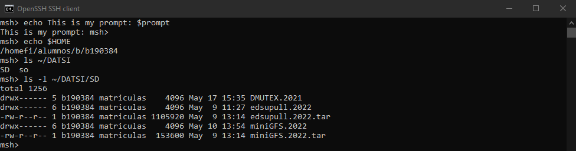

This project is one of the most satisfying things I could ever done. I always was very 
curious on how a shell works internally and this project gives me the first idea. This shell is a minimal version of a real big shell like bash or zsh for example. It was made in C by using multiple processes and executions (fork() and exec()).

#### Internal commands

The shell is completly ready to execute internal commands of the OS like:

* `ls`
* `date`
* `cat`
* `echo`
* `And an infinite list of commands ...`

#### External commands

There are also another commands that are commitment of the own shell. I implemented this:

* `cd [dir]`
* `umask [value]`
* `limit [resource [max]]`
* `set [variable [value...]]`

    
#### Pipes, redirections, background and signals

1. As we all know, we can use pipes `A | B` to use the standard output of `A` as the standard input of `B`. Each pipe creates a new child that is responsible of executing its command with the standard output of the left child.

2. We can also redirect the standard output to a file with `A > file` or the redirect the standard input from a file with `A < file`.

3. If we want to send to the background some task we can do it by typing `&` at the end of the command. Example: `sleep 10 &`.

4. On the one hand we can't kill the shell with *Ctrl+C* or *Ctrl+\\* it will be impossible, like a real shell. The only way of exiting the shell is by inserting a EOF with *Ctrl+D*. On the other hand we can kill processes that we executed in the frontground or background.

#### Wildcards, metacharacters and variables

1. The shell incorporates the posibility of the using the *?* wildcard, which tries to replace a character in that position.

2. The shell interpretates some special characters like *~* or *$*
    2. `~[user]` if user appears, then is replaced by the `home` of `user`. Otherwise by the home's user that executed the command.
    2. `$variable` replace it by the `value` of the environment variable `variable`.

3. There are special variables that the shell interpretes in a special way.
    3. `prompt` The minishell prompt (msh> by default)
    3. `mypid`&nbsp; The *pid* of the shell process
    3. `bgpid`&nbsp; The *pid* of the last ran background process
    3. `status` The return value of the last command or pipeline

