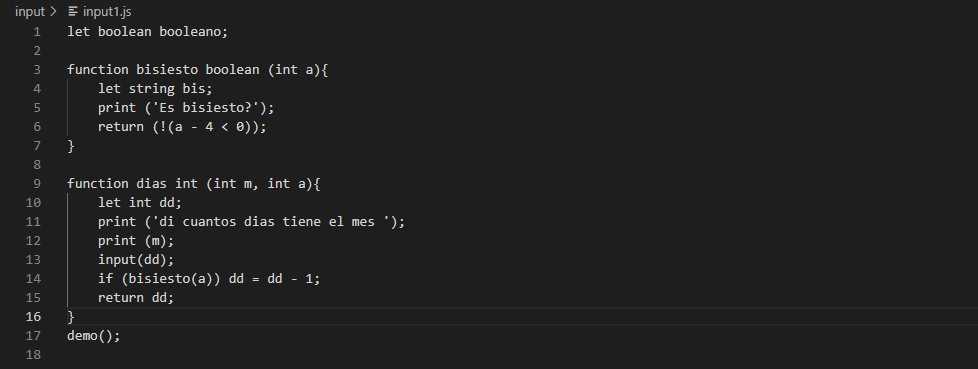
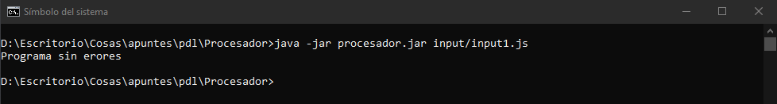
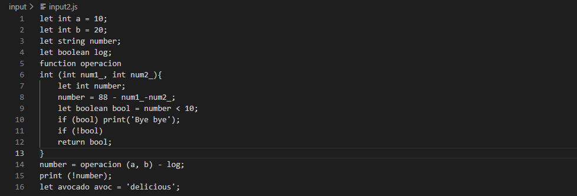
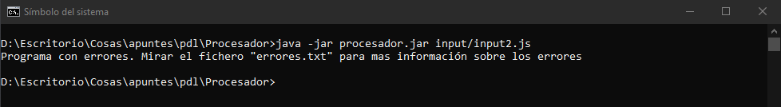
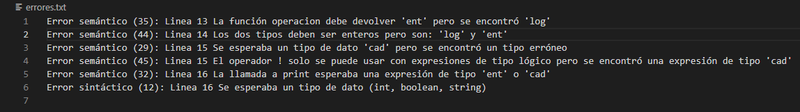

This is one of my biggest projects I have ever done. It is a reduced lexic, syntactic and semtatic processor of a modified version of Javascript where you give it a source javascript file and it returns if the file is well written. In case of failure, it will give you the lines where the error is and the mistakes you did, like a usual compiler.

### Symbols

There are a few logic and aritmethic symbols that I implemented:

* `<`&nbsp;&nbsp;&nbsp;Minor than 
* `!`&nbsp;&nbsp;&nbsp;Negation
* `-`&nbsp;&nbsp;&nbsp;Minus 
* `=`&nbsp;&nbsp;&nbsp;Assignment 
* `%=`&nbsp;&nbsp;Modular assignment 

Apart of this, thare are the essential symbols like round and curly brackets, double slash for commenting lines, single quotes for string variables and so on.

### Variables, functions, decisions and loops

Here we declare some of this modified javascript language types, predefined functions, statements and functions.

* `int`, `boolean`, `string`
* `print`, `input`
* `if`, `for`
* `function`

### Examples

#### Correct

This is a **correct** input:

So the processor prints out that everything is good:

#### Incorrect

This is an **incorrect** input:

And the processor says that we have to check a file where the errors are displayed:

The **errors** file:

