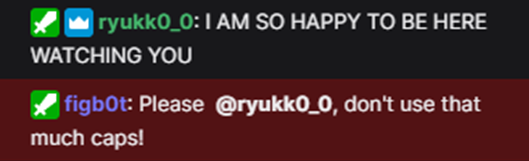

Figbot is an intelligent <a href="https://www.twitch.tv/" target="_blank">twitch</a> bot which helps the streamer to moderate the chat. The proupose of this project was to use *jade*, a java library for an *agent oriented* paradigm. Every agent has a unique responsability and they communicate to others with TCP/IP messages.

### Commands

Figbot includes a set of commands where the user can type them in the chat with the prefix `f!`:

* `f!help`
* `f!greetings [user]`
* `f!shoutout [user]`
* `f!dice [sides]`
* `f!time`
* `f!video [user]`
* `f!title`

Figbot is able to **ban** or **timeout**, among others, automatically recognising intelligently the message of the user who don't behave in a polite way.

### Interface

The app incorporates a **GUI** where are displayed the most importants moderation events like:

* Slow and slow off the chat
* Deleted messages
* Timeouts
* Bans and unbans

On the **<a class="twitch" href="https://www.twitch.tv/" target="_blank" color="#815fc0">twitch</a>** side we can see every moderation events in the chat. Here are presented some examples:

     