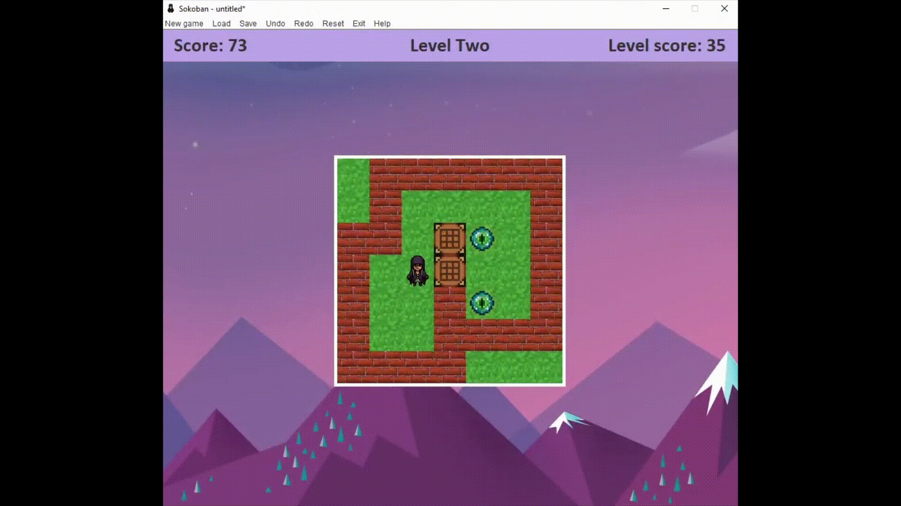

Sokoban is a 80's game where the objetive is to put every boxes of the grid into the goal points to pass to the next level. In this version we change every game sprites to make it prittier and different.

### Controls

The controls are very simple. There are only 4 keys to play, each for every cardinal directions:

* **W**&nbsp;&nbsp;&nbsp;Up
* **A**&nbsp;&nbsp;&nbsp;Left
* **S**&nbsp;&nbsp;&nbsp;Right 
* **D**&nbsp;&nbsp;&nbsp;Down 

### Shortcuts

Apart of the existing buttons in the GUI, there are available shortcuts to make the gameplay more dynamic and easy.

* *Ctrl+Z*&nbsp;&nbsp;&nbsp;Undo the movement
* *Ctrl+Shift+Z*&nbsp;&nbsp;&nbsp;Redo the movement
* *Ctrl+S*&nbsp;&nbsp;&nbsp;Save the current game
* *Ctrl+L*&nbsp;&nbsp;&nbsp;Load a game
* *Ctrl+N*&nbsp;&nbsp;&nbsp;New game

### Demo

            

