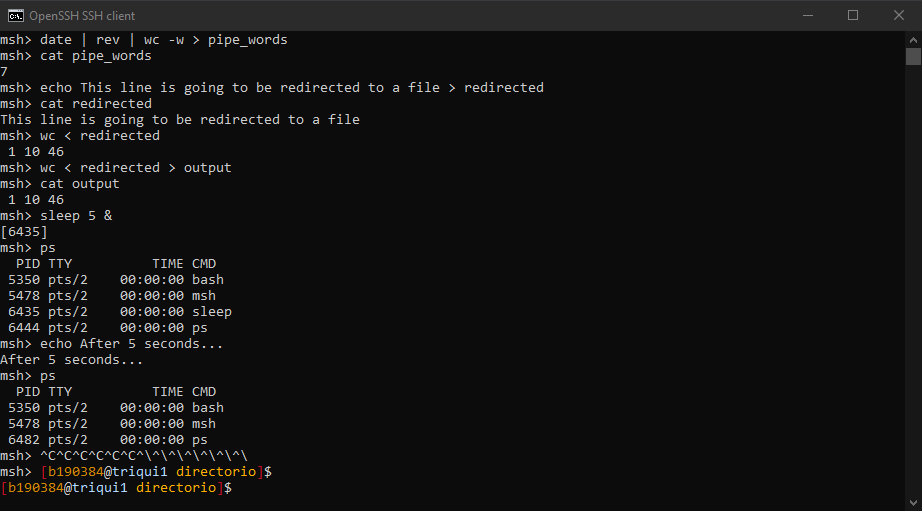

This project is one of the most satisfying things I could ever done. I always was very 
curious on how a shell works internally and this project gives me the first idea. This shell is a minimal version of a real big shell like bash or zsh for example. It was made in C by using multiple processes and executions (fork() and exec()).

#### Internal commands

The shell is completly ready to execute internal commands of the OS like:

* `ls`
* `date`
* `cat`
* `echo`
* ...

### Examples

#### External commands

There are also another commands that are commitment of the own shell. I implemented this:

* `cd [dir]`
* `umask [value]`
* `limit [resource [max]]`
* `set [variable [value...]]`

### Examples

    
#### Pipes, redirections, background and signals

1. As we all know, we can use pipes `A | B` to use the standard output of A as the standard input of B. Each pipe creates a new child that is responsible of executing its command with the standard output of the left child.

2. We can also redirect the standard output to a file with `A > file` or the redirect the standard input from a file with `A < file`.

3. If we want to send to the background some task we can do it by typing `&` to the end of the command. Example: `sleep 10 &`.

4. If we want to kill the process with *Ctrl+C* or *Ctrl+\\* it will be impossible, like a real shell. The only way of exiting the shell is by inserting a EOF with *Ctrl+D*.

### Examples

